# Josephus problem

The Josephus problem is a classic puzzle in mathematics and computer science, describing a scenario where $n$ people stand in a circle and are systematically eliminated by counting every $k$-th person (with $k≥2$) until only one survivor remains; the goal is to determine the initial position of that survivor, denoted as $Jk(n)$. This elimination process forms a permutation of the positions, and the problem has been generalized to various counting rules and moduli.

```
def josephus(n,k):
    arr = list(range(1,n+1))
    p=k-1
    while len(arr) >1:
        while p>=len(arr):
            p-=len(arr)
        arr.pop(p)
        p+=k-1
    return arr[0]
```

The `josephus` function works by simulating the elimination process directly on an array. Here's the breakdown:

The outer `while` loop runs **n-1** times (until one person remains). Inside, the inner `while` loop adjusts the pointer `p` when it exceeds the array length, and `arr.pop(p)` (mid-array deletion) costs O(n) because it shifts all subsequent elements.

This gives an overall time complexity of **O(n²)**.



**Why O(n²):**

- The outer `while` loop iterates **n−1** times (eliminates one person per iteration).
- Inside each iteration, `arr.pop(p)` removes an element from the **middle** of the array. JavaScript must shift all elements after index `p` to fill the gap — that's O(n) per deletion.
- Combined: O(n) × O(n) = **$O(n^2)$**.

The inner `while` that adjusts `p` is bounded by the array size and doesn't add to the overall complexity.

**Space complexity: O(n)** — the array stores all n elements initially.

**For comparison**, the mathematical (Josephus recurrence) solution runs in O(n) time using no extra array at all: `J(1,k)=0`, `J(n,k)=(J(n-1,k)+k) % n`. And that array-simulation approach trades mathematical insight for code readability.
