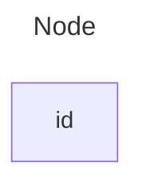

# Add Two Numbers

```python
# Definition for singly-linked list.
# class ListNode:
#     def __init__(self, val=0, next=None):
#         self.val = val
#         self.next = next
```



$$ 342 + 465 = 807 $$
