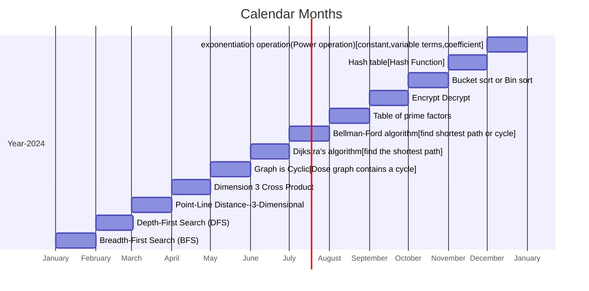

```mermaid

gantt
    title Calendar Months
    dateFormat MM-DD
    axisFormat %B
    section Year-2024
        exponentiation operation(Power operation)[constant,variable terms,coefficient]  :12-01, 31d
        Hash table[Hash Function]  :11-01, 30d
        Bucket sort or Bin sort  :10-01, 31d
        Encrypt Decrypt  :09-01, 30d
        Table of prime factors  :08-01, 31d
        Bellman-Ford algorithm[find shortest path or cycle] :07-01, 31d
        Dijkstra's algorithm[find the shortest path] :06-01, 30d
        Graph is Cyclic[Dose graph contains a cycle]  :05-01, 31d
        Dimension 3 Cross Product  :04-01, 30d
        Point-Line Distance--3-Dimensional  :03-01, 31d
        Depth-First Search (DFS)          :02-01, 29d
        Breadth-First Search (BFS)          :01-01, 31d
```
