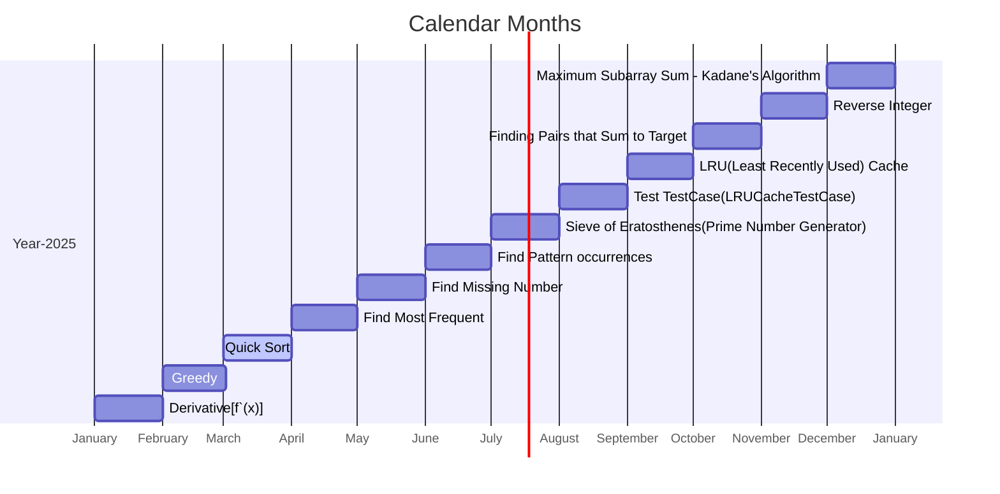

```mermaid

gantt
    title Calendar Months
    dateFormat MM-DD
    axisFormat %B
    section Year-2025
        Maximum Subarray Sum - Kadane's Algorithm:12-01, 31d
        Reverse Integer:11-01, 30d
        Finding Pairs that Sum to Target :10-01, 31d
        LRU(Least Recently Used) Cache :09-01, 30d
        Test TestCase(LRUCacheTestCase) :08-01, 31d
        Sieve of Eratosthenes(Prime Number Generator)    :07-01, 31d
        Find Pattern occurrences :06-01, 30d
        Find Missing Number :05-01, 31d
        Find Most Frequent :04-01, 30d
        Quick Sort      :active, 03-01, 31d
        Greedy          :02-01, 29d
        Derivative[f`(x)]          :01-01, 31d
```
