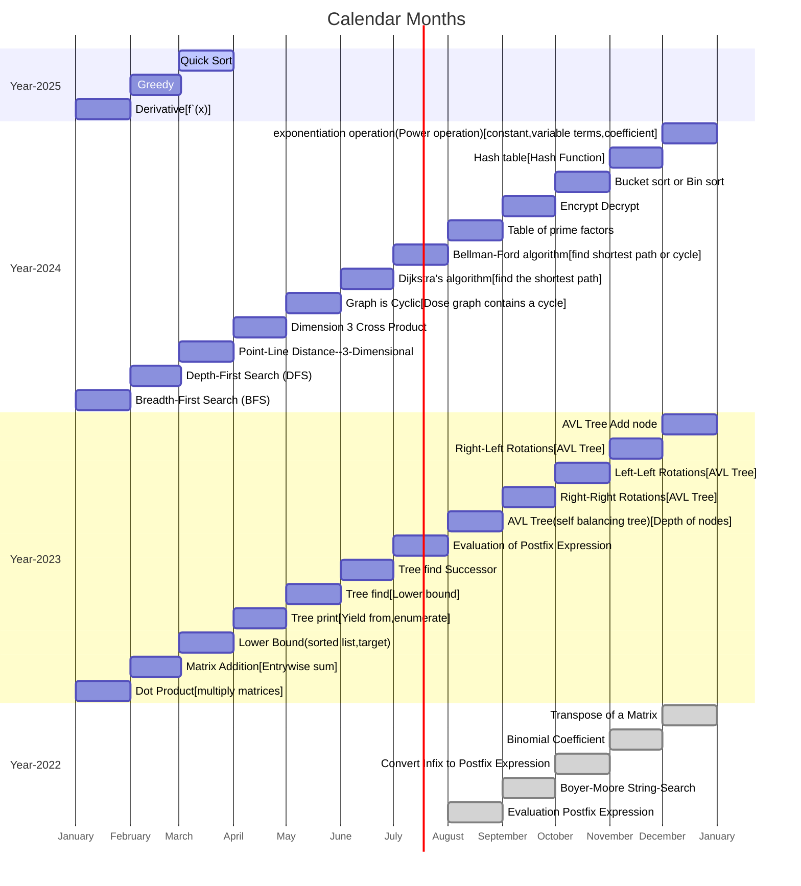

```mermaid

gantt
    title Calendar Months
    dateFormat MM-DD
    axisFormat %B
    section Year-2025
        Quick Sort      :active, 03-01, 31d
        Greedy          :02-01, 29d
        Derivative[f`(x)]          :01-01, 31d
    section Year-2024
        exponentiation operation(Power operation)[constant,variable terms,coefficient]  :12-01, 31d
        Hash table[Hash Function]  :11-01, 30d
        Bucket sort or Bin sort  :10-01, 31d
        Encrypt Decrypt  :09-01, 30d
        Table of prime factors  :08-01, 31d
        Bellman-Ford algorithm[find shortest path or cycle] :07-01, 31d
        Dijkstra's algorithm[find the shortest path] :06-01, 30d
        Graph is Cyclic[Dose graph contains a cycle]  :05-01, 31d
        Dimension 3 Cross Product  :04-01, 30d
        Point-Line Distance--3-Dimensional  :03-01, 31d
        Depth-First Search (DFS)          :02-01, 29d
        Breadth-First Search (BFS)          :01-01, 31d
    section Year-2023
        AVL Tree Add node :12-01, 31d
        Right-Left Rotations[AVL Tree] :11-01, 30d
        Left-Left Rotations[AVL Tree] :10-01, 31d
        Right-Right Rotations[AVL Tree] :09-01, 30d
        AVL Tree(self balancing tree)[Depth of nodes] :08-01, 31d
        Evaluation of Postfix Expression :07-01, 31d
        Tree find Successor :06-01, 30d
        Tree find[Lower bound] :05-01, 31d
        Tree print[Yield from,enumerate] :04-01, 30d
        Lower Bound(sorted list,target) :03-01, 31d
        Matrix Addition[Entrywise sum] :02-01, 29d
        Dot Product[multiply matrices] :01-01, 31d
    section Year-2022
        Transpose of a Matrix :done, 12-01, 31d
        Binomial Coefficient :done, 11-01, 30d
        Convert Infix to Postfix Expression :done, 10-01, 31d
        Boyer-Moore String-Search :done, 09-01, 30d
        Evaluation Postfix Expression :done, 08-01, 31d
```
